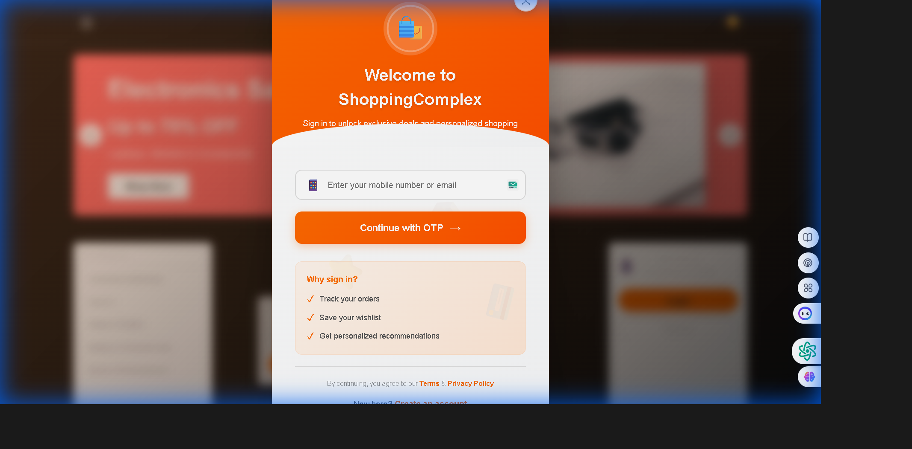
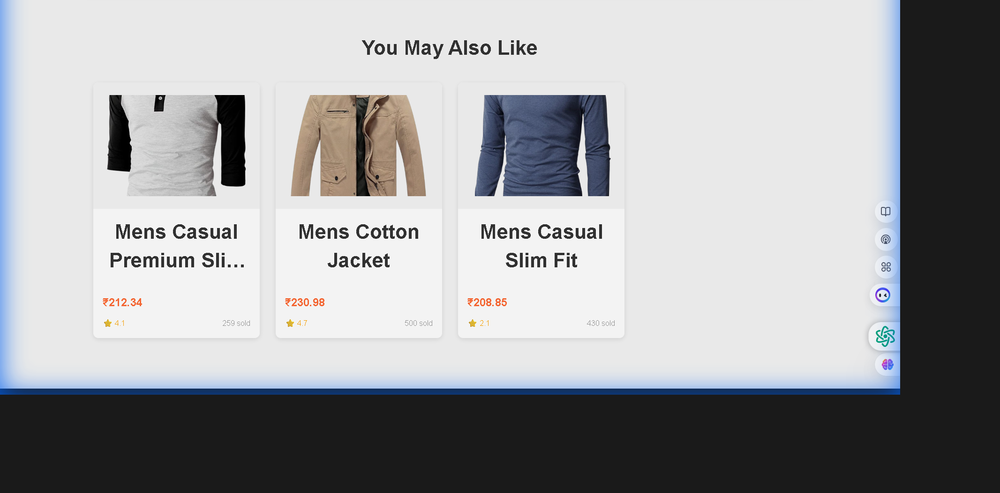
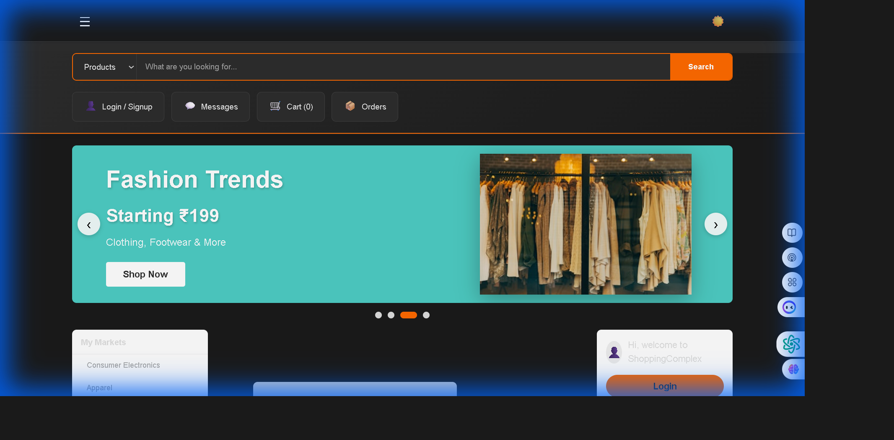

<div align="center">

# 🛍️ ShoppingComplex - E-Commerce Website

### A Modern React.js E-Commerce Platform

[](https://reactjs.org/)
[](https://vitejs.dev/)
[](https://reactrouter.com/)
[](LICENSE)

[Live Demo](#) • [Report Bug](#) • [Request Feature](#)

</div>

---

## 📋 Table of Contents

- [About](#about)
- [Features](#features)
- [Screenshots](#screenshots)
- [Technologies](#technologies)
- [Getting Started](#getting-started)
- [Installation](#installation)
- [Usage](#usage)
- [Project Structure](#project-structure)
- [Contributing](#contributing)
- [License](#license)
- [Contact](#contact)

---

## 🎯 About

**ShoppingComplex** is a modern, full-featured e-commerce website built with React.js, inspired by Alibaba.com's design. It provides a seamless shopping experience with product browsing, user authentication, smart recommendations, and a dynamic shopping cart system.

### Why ShoppingComplex?

- ✅ **Modern Tech Stack** - Built with latest React.js and Vite
- ✅ **Smart Recommendations** - AI-powered product suggestions
- ✅ **Responsive Design** - Works perfectly on all devices
- ✅ **Fast Performance** - Optimized for speed and efficiency
- ✅ **Easy to Customize** - Clean, modular code structure

---

## ✨ Features

### 🛒 **Shopping Experience**
- Browse products with detailed information (images, prices, ratings)
- Smart product recommendations based on browsing history
- Add to cart functionality with real-time updates
- Product detail pages with "Buy Now" and "Add to Cart" options

### 🔐 **User Authentication**
- Complete signup form with validation
  - Full Name, Phone Number, Date of Birth
  - Email and Password with confirmation
  - "I am not a robot" verification
- Secure login system
- Session management

### 🎨 **UI/UX Features**
- Auto-sliding banner carousel for promotions
- Category sidebar for easy navigation
- Responsive design for mobile and desktop
- Smooth animations and transitions
- Modern, clean interface

### 💰 **Localization**
- All prices displayed in Indian Rupees (₹)
- Price range: ₹200 - ₹5000
- Localized product information

---

## 📸 Screenshots

<div align="center">

### Home Page


### Product Details


### Shopping Cart


</div>

---

## 🛠️ Technologies

### Frontend
- **React.js** - UI library
- **React Router DOM** - Navigation and routing
- **Vite** - Build tool and dev server
- **CSS3** - Styling and animations

### APIs
- **Fake Store API** - Product data source

### Development Tools
- **ESLint** - Code linting
- **PropTypes** - Type checking
- **Git** - Version control

---

## 🚀 Getting Started

### Prerequisites

Before you begin, ensure you have the following installed:
- **Node.js** (v16 or higher) - [Download here](https://nodejs.org/)
- **npm** (comes with Node.js)
- **Git** - [Download here](https://git-scm.com/)

### Check Installation
```bash
node --version
npm --version
git --version
```

---

## 📦 Installation

### 1️⃣ Clone the Repository
```bash
git clone https://github.com/Rahu1007/ShoppingComplex---E-Commerce-Website.git
cd ShoppingComplex---E-Commerce-Website
```

### 2️⃣ Install Dependencies
```bash
npm install
```

This will install all required packages including:
- react
- react-dom
- react-router-dom
- vite
- eslint

### 3️⃣ Start Development Server
```bash
npm run dev
```

The application will open at: **http://localhost:5173**

---

## 💻 Usage

### Available Scripts

| Command | Description |
|---------|-------------|
| `npm run dev` | Start development server |
| `npm run build` | Build for production |
| `npm run preview` | Preview production build |
| `npm run lint` | Run ESLint to check code quality |

### Development Workflow

1. **Start the dev server**
   ```bash
   npm run dev
   ```

2. **Make your changes** in the `src/` directory

3. **Build for production**
   ```bash
   npm run build
   ```

4. **Preview the build**
   ```bash
   npm run preview
   ```

---

## 📁 Project Structure

```
ShoppingComplex/
├── 📂 public/                  # Static assets
│   └── vite.svg
├── 📂 src/
│   ├── 📂 components/          # Reusable components
│   │   ├── 📂 Layout/
│   │   │   ├── Header.jsx      # Navigation header
│   │   │   ├── Footer.jsx      # Footer component
│   │   │   └── CategorySidebar.jsx
│   │   ├── 📂 Home/
│   │   │   ├── HeroSection.jsx # Hero banner
│   │   │   └── BannerSlider.jsx # Auto-slider
│   │   └── 📂 Product/
│   │       ├── ProductCard.jsx  # Product display card
│   │       └── RecommendationSection.jsx
│   ├── 📂 pages/               # Page components
│   │   ├── Home.jsx            # Homepage
│   │   ├── Login.jsx           # Login page
│   │   ├── Signup.jsx          # Registration page
│   │   └── ProductDetail.jsx   # Product details
│   ├── 📂 context/             # State management
│   │   └── ShopContext.jsx     # Global shopping context
│   ├── 📂 data/                # Mock data
│   │   └── mockData.js
│   ├── App.jsx                 # Main app component
│   ├── main.jsx                # Entry point
│   └── index.css               # Global styles
├── index.html                  # HTML template
├── package.json                # Dependencies
├── vite.config.js              # Vite configuration
└── README.md                   # Documentation
```

---

## 🎨 Customization

### Change Theme Colors
Edit `src/index.css`:
```css
:root {
  --primary-orange: #ff6600;  /* Change to your color */
  --text-dark: #333;
  --text-light: #666;
}
```

### Modify Price Range
Edit `src/context/ShopContext.jsx`:
```javascript
// Change min and max prices
price: 200 + ((item.price / maxOriginalPrice) * (5000 - 200))
```

### Update Banner Slides
Edit `src/components/Home/BannerSlider.jsx`:
```javascript
const slides = [
  {
    title: 'Your Title',
    subtitle: 'Your Subtitle',
    description: 'Your Description',
    bgColor: '#yourcolor',
    image: 'your-image-url'
  }
];
```

---

## 🌟 Key Features Explained

### 🎯 Smart Recommendations
The recommendation system tracks user browsing history and suggests products from similar categories:
- Stores last 10 viewed products
- Analyzes category preferences
- Updates recommendations in real-time

### 🎪 Auto-Slider Banner
- Automatically rotates every 3 seconds
- Manual navigation with arrows
- Dot indicators for quick access
- Smooth fade transitions

### 🛒 Shopping Cart
- Real-time cart updates
- Persistent cart state
- Quick "Buy Now" checkout
- Cart count in header

---

## 🤝 Contributing

Contributions are welcome! Here's how you can help:

1. **Fork the repository**
2. **Create a feature branch**
   ```bash
   git checkout -b feature/AmazingFeature
   ```
3. **Commit your changes**
   ```bash
   git commit -m 'Add some AmazingFeature'
   ```
4. **Push to the branch**
   ```bash
   git push origin feature/AmazingFeature
   ```
5. **Open a Pull Request**

---

## 🐛 Troubleshooting

### Common Issues

**❌ npm install fails**
```bash
# Solution: Clear cache and reinstall
rm -rf node_modules package-lock.json
npm install
```

**❌ Port 5173 already in use**
```bash
# Solution: Kill the process or use different port
# Vite will automatically use next available port
```

**❌ Products not loading**
- Check internet connection
- Verify API endpoint is accessible
- Check browser console for errors

---

## 📄 License

This project is licensed under the MIT License - see the [LICENSE](LICENSE) file for details.

---

## 👨‍💻 Author

**Rahul Sharma**

- GitHub: [@Rahu1007](https://github.com/Rahu1007)
- Project Link: [ShoppingComplex](https://github.com/Rahu1007/ShoppingComplex---E-Commerce-Website)

---

## 🙏 Acknowledgments

- [Fake Store API](https://fakestoreapi.com/) - Product data
- [React.js](https://reactjs.org/) - UI framework
- [Vite](https://vitejs.dev/) - Build tool
- [Unsplash](https://unsplash.com/) - Banner images

---

## 📞 Support

If you have any questions or need help, please:
- Open an [Issue](https://github.com/Rahu1007/ShoppingComplex---E-Commerce-Website/issues)
- Contact: [Your Email]

---

<div align="center">

### ⭐ Star this repository if you found it helpful!

**Made with ❤️ by Rahul Sharma**

</div># shoppingcomplex-ecommerce-website

